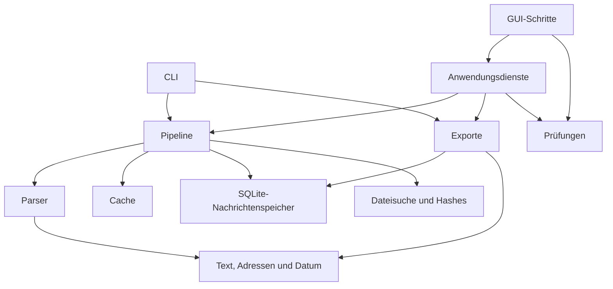

# MailAnalyst – Architektur und Entwicklung

Stand: 11. September 2026

Einstieg und Kontextauswahl: [AGENTS.md](../../AGENTS.md). Aktuelle Prioritäten: [STATUS.md](../STATUS.md). Feldbedeutungen und Formatunterschiede: [DATA_MODEL.md](DATA_MODEL.md).

## Aufbau

MailAnalyst ist eine lokale Python-Anwendung mit CLI und Tkinter-GUI. Das Paket `mailanalyst/` enthält die Implementierung. Die Skripte im Projektstamm bleiben als schlanke CLI- und GUI-Einstiegspunkte erhalten.

| Bereich | Verantwortung |
| --- | --- |
| `cli.py`, `__main__.py` | Argumente, CLI-Lauf und Laufprotokoll |
| `config.py`, `models.py`, `message_schema.py` | Gemeinsame Konstanten, Dateisignatur und versionierter Nachrichtenvertrag |
| `version.py` | App-Version und gebündelte Buildmetadaten, unabhängig von Parser-/Cacheschema |
| `source_guard.py` | Vergleich der Importdatei mit dem SHA-256-Vorprüfungsstand |
| `discovery.py`, `hashing.py` | Quellen finden und Dateimerkmale erfassen |
| `batch_cache.py`, `record_store.py` | Einzelne Cache-/Nachrichtenzeilen, begrenzte Batches, SQLite-Sortierung und atomarer Cacheersatz |
| `cache.py` | Gemeinsame Cachekriterien und materialisierende Kompatibilität für Speicherformat 1 |
| `source_processing.py` | Cachekriterien, Backendwahl und Vorher-/Nachher-Quellenprüfung |
| `runs.py` | Laufmanifest, Paketveröffentlichung und Abschlussstatus |
| `legacy_outputs.py`, `cli_paths.py` | CLI-Kompatibilitätskopien und Pfadkollisionsprüfung |
| `batch_pipeline.py`, `batch_sources.py` | Begrenzte EML-/MSG-Parallelität und PST-Streaming mit Quellenprüfung |
| `pipeline.py` | Materialisierende DataFrame-Kompatibilität für kleine direkte Aufrufe |
| `services.py` | Vorprüfung mit Bericht sowie Verarbeitung eines festen GUI-Auftrags |
| `parsing/` | EML, MSG, Outlook-PST, libpff-PST, MIME-Hilfen und Importerauswahl |
| `text/` | Text- und HTML-Aufbereitung, Links, Adressen und Datumsfelder |
| `exports/` | Formatauswahl, strukturierte Formate, Tabellen, Markdown-Härtung und Ausgabeprofile |
| `checks/` | Dateivorprüfung und Prüfung der Laufzeitumgebung |
| `checks/targets.py` | Auftragsbezogene Komponenten, tatsächliche Schreibziele und Platzwarnungen |
| `gui/app.py` | Fenster, gemeinsame Eingabewerte und Navigation |
| `gui/steps/` | Eigene Klasse pro Schritt mit den zugehörigen Widgets und Aktionen |
| `gui/jobs.py` | Ein Worker, zusammengefasste Fortschrittsmeldungen, Abschlussqueue und geordnetes Schließen |
| `progress.py`, `gui/processing_display.py` | Typisierte Phasenmeldungen, Nachrichtenzähler und Tk-Laufzeituhr |
| `review_store.py`, `gui/paging.py` | Kompakter Ergebnisindex sowie begrenzte Seiten und Filter |
| `gui/activity.py` | Eingabe-/Navigationssperren, Abbruchanzeige und Freigabe der GUI-Ressourcen |
| `cancellation.py` | GUI-unabhängiges Abbruchsignal und synchronisierte Veröffentlichungsgrenze |
| `text/cells.py` | CSV-Darstellung formelverdächtiger Zeichenfolgen |
| `gui/theme.py`, `gui/resources.py` | Oberflächengestaltung, Schriftressourcen und Windows-DPI |
| `tests/` | Synthetische Regressionstests und Architekturprüfungen |
| `docs/` | Architektur, Datenmodell, aktueller Status und historische Berichte |

`mail_analyst.py` startet ausschließlich die CLI. Die alten Funktions-Reexports sowie die Kompatibilitätsmodule `preflight.py` und `system_check.py` im Projektstamm wurden entfernt. Anwendungscode und Tests importieren direkt aus dem Paket; externe Skripte müssen ihre alten Imports entsprechend umstellen. Historische Review- und Prüfberichte liegen unter `docs/02_reports/`.

## Abhängigkeiten



Kernmodule kennen weder Tkinter noch die Einstiegsskripte. Optionale MSG-/PST-Bibliotheken werden weiterhin erst im jeweiligen Importer geladen. Dadurch erfordert ein EML-Lauf keine Outlook- oder libpff-Installation.

## GUI und Hintergrundarbeit

Die Anwendung setzt die fünf Schrittklassen durch Komposition zusammen. Es gibt keine Verteilung einer gemeinsamen großen Klasse auf Mixins. Jeder Schritt besitzt seine Widgets; die Anwendung hält gemeinsam verwendete Eingaben und Navigation. Die Ergebnisansicht bietet eine eigene Methode zur Darstellung eines abgeschlossenen Laufs.

Beim Verarbeitungsstart werden die Tkinter-Werte im Hauptthread in ein unveränderliches `ProcessingOptions`-Objekt kopiert. `services.process_sources()` verarbeitet ausschließlich gewöhnliche Python-Werte. Die GUI-Auswahl kann damit nicht nachträglich den Zielort oder das Exportprofil dieses Auftrags verändern.

Der Auftrag enthält außerdem Kopien der Vorprüfungsergebnisse. Pro gewählter Quelle
übergibt der Service Größe, Änderungszeit und SHA-256 an die Batchpipeline; Einzel-
und Archivimport vergleichen diesen Stand direkt beim Lesen, auch bei Cachetreffern.
Direkte Service-Aufrufe ohne Vorprüfung sowie CLI-Läufe erzeugen zunächst einen
neuen Vorprüfungsstand. Berichte liegen im Laufordner. Die GUI-Inventarisierung
erfasst auch nicht unterstützte Dateien und schließt den gewählten Zielteilbaum aus;
Verzeichnis-Symlinks werden nicht rekursiv verfolgt. Ignorierte Dateien sind nicht auswählbar.

`version.APP_VERSION` ist die zentrale App-Version. `scripts.write_build_info`
zeichnet Git-Revision, lokalen Änderungsstatus, Quellbaum-Hash und installierte
Paketversionen auf und sichert den Quellstand lokal als ZIP. Die EXE liest diese
Metadaten aus einer gebündelten JSON-Datei; Entwicklungsaufrufe kennzeichnen sich
als `development`. `scripts.package_manifest` schreibt die Dateiprüfsummen des
portablen Pakets. Die lokale Windows-Abnahme verwendet Python 3.11.9 und
`requirements-windows-lock.txt`, prüft Dokumentations-Dateiziele und führt den Build aus. Abschnittsanker und eine
einheitliche Codeformatierung sind nicht durch die Linkprüfung abgedeckt.

`BackgroundJobs` führt Arbeit in Threads aus. Fortschritt hält pro Meldungsform nur den neuesten Stand unter einer Sperre; Ergebnisse und Fehler liegen in einer Abschlussqueue. Ein von Tkinter geplanter Poll ruft die GUI-Callbacks im Hauptthread auf. Worker lesen keine Tkinter-Variablen und rufen keine Tkinter-Methoden auf.

`BackgroundJobs.submit()` akzeptiert nur einen Auftrag und sperrt weitere Starts bis zur Verarbeitung des Abschlussereignisses und bestätigtem Threadende. `Activity` sperrt Eingaben und Navigation und stellt die ursprünglichen Widgetzustände wieder her. Alle Startmethoden prüfen zusätzlich die zentrale Sperre. Eine neue Vorprüfung oder Verarbeitung entzieht veralteten Ergebnissen die Navigationsfreigabe.

Ein GUI-unabhängiges `Cancellation`-Objekt wird über den Fortschrittsadapter an Service, Pipeline und Quellenprüfung übergeben. Hashschleifen, einzelne Nachrichten sowie Export-/Validierungsschleifen prüfen dieses Signal. Bibliotheksaufrufe werden nicht gewaltsam unterbrochen. `begin_commit()` entscheidet atomar zwischen bereits angefordertem Abbruch und beginnender Veröffentlichung. Ein danach eintreffender Abbruch wird abgelehnt; der Abschluss läuft weiter.

Beim Fensterschließen fordert die Jobsteuerung den Abbruch an, unterdrückt weitere GUI-Ergebnis-/Fehlercallbacks und wartet ohne blockierendes `join()` im Tk-Thread auf das Workerende. Erst danach werden Log-Handler und Timer geschlossen und Tk zerstört. Ein hängender Fremdparser kann das Schließen weiterhin verzögern; Prozessisolation ist nicht implementiert.

Die GUI übergibt optional einen Phasen-Callback an den Service. `PhaseReporter` begrenzt dessen Frequenz; der bestehende Quellen-Callback bleibt kompatibel. Export und Validierung melden getrennte Phasen. Die Aktivitätsanzeige verwendet während des Laufs keinen Gesamtprozentsatz. Nachrichtenzähler und Uhr werden ausschließlich im Tk-Thread aktualisiert; beim Abschluss, Abbruch und Schließen werden die Anzeige-Timer beendet. Der Quellenbericht der gewählten Auswahl wird im Worker geschrieben.

`exports/review.sqlite3` wird vor Veröffentlichung in begrenzten Batches erzeugt und in die Exporthashes aufgenommen. Der GUI-Leser öffnet ihn kurzzeitig schreibgeschützt und liest höchstens 500 Metadatenzeilen. Er hält keine Mailtexte und keine dauerhafte Verbindung zum Arbeitscache. Die CLI erzeugt diesen GUI-Index derzeit nicht.

`message_schema.assess_message()` erzwingt vor Cache-/Laufspeicherung die
versionierten Pflichtbezüge, skalaren Feldtypen, Parserstatus und UTC-Annahme.
Nicht zwingend fehlerhafte Qualitätslücken erhalten stabile Warncodes. Der
`RecordStore` zählt sie und der Lauf schreibt sie mit Nachrichtenposition und
Quellbezug nach `quality_warnings.jsonl`; sie verändern die Masterfelder nicht.
Markdown-Ausgaben maskieren strukturwirksame Metadaten und stellen Mailtext als
eigenen Zitatbereich dar. Mailinhalt kann dadurch keine gleichrangige generierte
Überschrift oder HTML-Struktur mehr erzeugen.

## Namenskonvention und Ordnerreihenfolge

- Eigene Ordner und Python-Dateien erhalten englische, sprechende Namen in `snake_case`, ohne Leerzeichen oder Umlaute. Tests heißen `test_<bereich>.py`.
- Nur Dokumentationsbereiche werden nach Lesereihenfolge nummeriert: `docs/01_guides/` für gepflegte Architektur- und Datenmodellbeschreibungen, `docs/02_reports/` für historische Nachweise. Präfixe bestehen aus zwei Ziffern und einem Unterstrich. Zusätzliche Bereiche nur bei tatsächlichem Bedarf anlegen; bestehende Nummern stabil halten.
- `docs/STATUS.md` bleibt der direkte Einstieg zum aktuellen Stand. Zentrale Dokumente verwenden `UPPER_SNAKE_CASE.md`, beispielsweise `README.md`, `AGENTS.md` und `DATA_MODEL.md`.
- Berichte heißen `YYYY-MM-DD_<thema>.md`, mit dem Datum des dokumentierten Stands und einem englischen Thema in `snake_case`. Ein Umzug ändert weder Berichtsdatum noch historische Aussagen.
- Python-Pakete, Tests, Assets, Eingabe-/Ausgabeordner sowie Werkzeugordner werden nicht nummeriert. Insbesondere bleiben `mailanalyst/`, `tests/`, `assets/`, `.github/` und `.agents/` unverändert.
- Werkzeugseitige Namen wie `requirements-dev.txt` und `copilot-instructions.md`, Python-Sonderdateien wie `__init__.py`, Skillnamen in `kebab-case` sowie Originalnamen fremder Assets und Lizenzen sind bewusste Ausnahmen.
- Bei Umbenennungen alle Imports, Buildpfade, Dokumentationslinks und Skillverweise prüfen und gemeinsam aktualisieren. Die Namenskonvention ist Teil der Dokumentationsprüfung und des Reviews.

## Entwicklungsregeln

- Höchstens 200 physische Zeilen pro eigener Python-Datei, einschließlich Leerzeilen und Kommentaren. Das gilt auch für Tests und Einstiegsskripte.
- Nach Zuständigkeit teilen; keine künstlichen Zeilenverdichtungen und keine Sammelmodule für beliebige Hilfsfunktionen.
- Keine zyklischen Paketimporte, keine Rückimporte aus Kernmodulen in GUI oder Einstiegspunkte.
- Kleine Funktionen und explizite Imports bevorzugen. Frameworks sind für die Paketstruktur nicht erforderlich.
- Änderungen an Parsern, Exporten oder Modulgrenzen durch passende Regressionstests absichern.
- Bei Änderungen an Feldnamen, Datumsannahmen oder Exportsemantik das Datenmodell mitpflegen und Kompatibilität der Listenansicht beachten.
- Nach relevanten Arbeitsblöcken den Status mit Nachweis aktualisieren. Historische Berichte bleiben zeitlich eingeordnet; Regeln und laufende Aufgaben nicht in mehreren Dokumenten unabhängig pflegen.
- Originaldaten, erzeugte Exporte, Caches, virtuelle Umgebung und Buildprodukte bleiben außerhalb der Versionsverwaltung.

Dokumentation, Lizenzen und Testdaten haben keine 200-Zeilen-Grenze. Ein Architekturtest prüft die eigenen Python-Dateien im Stamm, im Paket sowie in `tests/` und gegebenenfalls `scripts/`.

Die gemeinsamen Regeln werden hier gepflegt. `AGENTS.md` und `.github/copilot-instructions.md` dienen als Einstieg und verweisen hierher. Der Repository-Skill [mailanalyst-verify](../../.agents/skills/mailanalyst-verify/SKILL.md) beschreibt den wiederholbaren Prüfablauf, nicht zusätzliche allgemeine Entwicklungsregeln.

## Dokumentationsprüfung nach Änderungen

Die Dokumentationsprüfung gehört zum Abschluss jedes Änderungsblocks. Prüfe anhand des tatsächlichen Diffs, ob dokumentierte Aussagen, Beispiele, Befehle oder Verweise angepasst werden müssen. Nach wesentlichen Umbauten ist diese Prüfung immer erforderlich, auch wenn das sichtbare Verhalten unverändert bleibt. Dazu zählen insbesondere Änderungen an Modulstruktur, Schnittstellen, Datenverarbeitung, GUI-Abläufen, Konfiguration, Abhängigkeiten, Build und Tests.

1. Ordne die Änderungen den betroffenen Dokumenten zu: Bedienung, Setup und Befehle → `README.md`; Modulgrenzen und Entwicklungsabläufe → `docs/01_guides/ARCHITECTURE.md`; Felder, Cache- und Exportsemantik → `docs/01_guides/DATA_MODEL.md`; Fortschritt, Einschränkungen und offene Aufgaben → `docs/STATUS.md`; ausdrücklich beschlossene fachliche Änderungen → `PROJECT_GOALS.md`. Prüfe bei geänderten Arbeitsabläufen auch `AGENTS.md`, Tool-Anweisungen und betroffene Repository-Skills.
2. Lies die betroffenen Abschnitte und gleiche sie mit der fertigen Implementierung und den tatsächlich ausgeführten Prüfungen ab. Aktualisiere notwendige Dokumentation im selben Auftrag, ohne eine zusätzliche Aufforderung abzuwarten. Technische Änderungen ändern nicht automatisch die fachlichen Projektziele.
3. Prüfe geänderte Verweise, Dateipfade und Beispiele. Halte Regeln an ihrer maßgeblichen Stelle und verwende andernorts Verweise. Historische Berichte bleiben historische Nachweise; dokumentiere neue Ergebnisse im aktuellen Status oder einem neuen datierten Bericht.
4. Nenne in der Abschlussmeldung kurz, welche Dokumentation aktualisiert wurde. Wenn keine Anpassung nötig war, bestätige die Prüfung mit einem konkreten Grund. Erzeuge keine Änderungen nur zum Nachweis einer Prüfung. Noch ausstehende notwendige Dokumentationsarbeit muss ausdrücklich als offen benannt werden; der Änderungsblock ist dann nicht vollständig abgeschlossen.

## Prüfungen

```powershell
.\.venv\Scripts\python.exe -m unittest discover -v
.\.venv\Scripts\python.exe -m compileall -q mailanalyst tests
.\.venv\Scripts\python.exe -m pip check
.\build_exe.ps1
```

Die Tests verwenden selbst erzeugte EML-Nachrichten mit HTML, Antwortbezug, Datumswechsel und Anlage. `tests/fixtures/exports.json` wurde vor der Modularisierung mit dem damaligen Code erzeugt und enthält ausschließlich synthetische Daten. Maschinenabhängige Quellpfade wurden normalisiert. CSV, JSON, XML, Markdown und Monatsindizes werden mit diesem Bestand verglichen; Parquet und Excel werden zurückgelesen und auf Dateninhalt geprüft.

Weitere Prüfungen decken Cachetreffer und geänderte Quellen, beide CLI-Aufrufe, den realen Tkinter-Ereignisablauf und die Importstruktur ab. GUI-Tests können ohne grafische Anzeige übersprungen werden; die lokale Windows-Abnahme benötigt deshalb eine grafische Sitzung. Auf Nutzerwunsch gibt es keine GitHub-CI; Pushes und Pull Requests starten keine Repository-Workflows.

Beim GUI-Testabbau werden die letzte App-Referenz und damit verbundene
Tk-Variablen explizit im GUI-Thread freigegeben und dort per Garbage Collection
finalisiert. Andernfalls kann eine spätere Sammlung in einem Parserworker Tcl
prozessweit abbrechen, obwohl die einzelnen Assertions bereits bestanden haben.

`tests/msg_samples.py` erzeugt echte Unicode-MSG-Container aus festgelegten synthetischen Werten mit dem CFB-Schreiber von `extract-msg`, ohne MailAnalyst-Parserfunktionen zu verwenden. Der Bestand enthält auch eine Nachricht ausschließlich mit komprimiertem RTF-Text. `tests/test_msg_files.py` prüft den realen MSG-Parser, Herkunft, Datumsgrenzen, beschädigte Dateien, Analysepaket, Cachetreffer und die Invalidierung früherer Parserrevisionen. `scripts/generate_msg_samples.py` stellt denselben Bestand für manuelle Prüfungen bereit. Dies ist kein Outlook-Kompatibilitätsnachweis und keine PST-Dateiprüfung.

Der MSG-Testschreiber unterstützt außerdem ANSI-Strings und mehrere Anlagen.
`tests/corpus_samples.py` definiert zehn MSG-/zwölf EML-Varianten und separate
negative Dateiproben; `scripts/generate_mail_corpus.py` erzeugt Wiederholungen
mit eindeutigen Message-IDs. `tests/test_mail_corpus.py` prüft reale Parser,
Vorprüfung, sieben Exportformate in unterschiedlicher Prüftiefe sowie einen
550-Nachrichten-Lauf einschließlich Cache und Ergebnisindex-Seiten.

`tests/test_pst_file.py` ist ein optional ausgeführter Windows-Integrationstest gegen eine
gehashte öffentliche PST-Referenzdatei. `scripts/fetch_pst_test_fixture.py` lädt
sie ausschließlich an einen expliziten neuen Pfad und verwirft Dateien mit
abweichender Prüfsumme. Die separate `requirements-pst-test.txt` fixiert das
Drittanbieter-Wheel für diesen Prüfweg zusätzlich samt Hash; dieselbe Abhängigkeit
gehört seit 0.7 zur Windows-Standardlaufzeit und zum Build. Dieser Test belegt den
tatsächlichen libpff-Dateipfad, ersetzt aber weder
ein selbst erzeugtes synthetisches Archiv noch einen Outlook-Test.

Der libpff-Adapter öffnet PST-Quellen als eigene binäre Leseströme und übergibt
sie an `pypff.open_file_object()`. Dadurch hängt der portable Windows-Build beim
Pfadauflösen nicht vom aktuellen Prozessarbeitsverzeichnis ab. Archiv und Strom
werden auch bei frühem Generatorabschluss oder Öffnungsfehler geschlossen.

Die vorhandenen Befehle `python mail_analyst.py` und `python mail_analyst_gui.py` bleiben erhalten. Zusätzlich ist `python -m mailanalyst` verfügbar. Der PyInstaller-Build verwendet weiterhin den GUI-Einstieg und nimmt das Paket über seine Imports auf. Schriftressourcen werden im Entwicklungsbetrieb relativ zur Projektwurzel, im Build relativ zu `sys._MEIPASS` gefunden.

## Historische Refactoring-Grenzen und aktueller Ausbau

Der [Prüfbericht zum Refactoring](../02_reports/2026-09-05_refactor_verification.md) dokumentiert den Stand vom 5. September. Seit dem Integritätsblock vom 6. September ersetzen SQLite-/JSON-Cache und Laufpakete die damalige Cache-/Exportorganisation. Die Nachrichtenspalten bleiben erhalten; Markdown-Indizes verwenden portable Pfadtrenner. Exportvalidierung liegt unter `exports/validation.py`, Einzelexporte werden temporär geschrieben. GUI und CLI teilen Cache, Pipeline, Validierung und Laufmanifest; explizite CLI-Ziele bleiben zusätzliche Kopien.

`batch_pipeline.build_store()` liefert für CLI und GUI einen offenen `RecordStore`; Aufrufer schließen ihn nach Export und Vorschau. Nachrichten werden einzeln in SQLite abgelegt, PST-Iteratoren bleiben bis zum Abschluss oder Abbruch geöffnet. EML-/MSG-Futures sind auf höchstens zweimal die Workerzahl begrenzt. Die Standardbatchgröße beträgt 500, zusätzlich gilt eine weiche 8-MiB-Textschwelle. Dateisuche und Vorprüfung halten weiterhin Quellenmetadaten im RAM.

Die Batchexporter unter `exports/` lesen Zeilen beziehungsweise Rowgroups. JSON-Validierung besitzt einen inkrementellen Arrayleser; Monatsindizes werden direkt geschrieben und sequenziell geprüft. Das Manifest verweist auf die separat gestreamte `sources.jsonl`; Quellen-Audits sind keine Nachrichtenspalten. Der Service liefert weiterhin höchstens 500 Vorschauzeilen mit Gesamtzahlen in DataFrame-Attributen. Die GUI lädt weitere Seiten und Fehler über `review_store.read_review()` aus dem veröffentlichten kompakten Index. Pro Tabelle werden höchstens 500 Widgetszeilen gerendert; Quellenfilter verwenden die vorhandene Metadatenliste mit stabilen Originalindizes. `pipeline.build_dataframe()` und bisherige DataFrame-Exporter bleiben explizite Kompatibilität für kleine Python-Aufrufe und werden von CLI/GUI nicht als primärer Datenpfad verwendet.

SQLite ist ein internes Dateiformat, keine Produktfunktion zur Datenbankanbindung. Reale PST-Abnahme, Zielhardware und Wiederaufnahme nach Prozessabbruch sind damit nicht gelöst.

Der [Reviewbericht](../02_reports/2026-09-04_review_report.md) bleibt ein historischer Befund mit ursprünglichen Dateinamen und Zeilennummern. Die [Projektziele](../../PROJECT_GOALS.md) beschreiben den fachlichen Auftrag. Neue technische Arbeiten werden gegen diese Ziele und die aktuelle Modulstruktur geplant.
